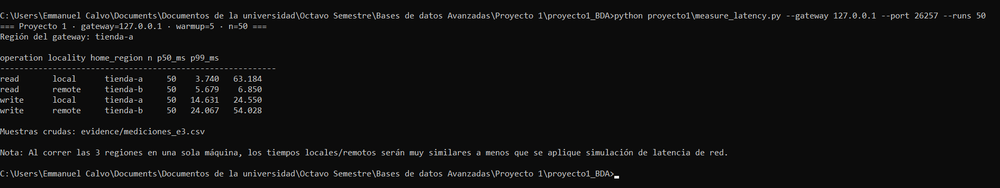

# Proyecto 1 — Base de Datos Distribuida (CockroachDB)

**Curso:** TI4601 - Bases de Datos Avanzadas -- Tecnológico de Costa Rica
**Motor:** CockroachDB ×3  
**Integrantes:** Calvo Mora Emmanuel, Feng Feng Jimmy, Navarro Ellerbrock Christian 
**Opción:** B (Sistema de comercio e inventario multi-tienda)  

El proyecto contiene la implementación y las instrucciones para desplegar, configurar y verificar el clúster multi-región de CockroachDB correspondiente al **Proyecto 1**.

---

## 1. Objetivo

Al completar los pasos de esta guía, se logra:

1. El despliegue automatizado de un clúster de CockroachDB de 3 nodos con localidades lógicas asociadas.
2. La ejecución de la configuración multi-región y aplicación del esquema con **fragmentación horizontal primaria** (`REGIONAL BY ROW`) y **tabla global** (`GLOBAL`).
3. Una carga del conjunto de datos inicial (`seed.sql`).
4. Mediante consultas de diagnóstico se realiza una inspección técnica de la distribución de rangos, localidades y estado de las regiones.

---

## 2. Arquitectura y Topología Lógica

El clúster simula una red de comercio distribuida en 3 sitios/regiones:

| Servicio | Localidad | Puerto Host | Función / Dominio |
| :--- | :--- | :--- | :--- |
| `crdb-1` | `region=tienda-a,zone=a` | SQL `26257`, UI `8080` | Nodo de entrada / Tienda A |
| `crdb-2` | `region=tienda-b,zone=a` | No publicado | Réplica / Tienda B |
| `crdb-3` | `region=cd-central,zone=a` | No publicado | Réplica / Centro de Distribución |

---

## 3. Guía de Reproducibilidad Paso a Paso Sección 2
 
### 3.1 Levantar la infraestructura Docker
 
Desde la raíz del repositorio en la terminal:
 
```cmd
docker compose --profile lab1 up -d
```
 
### 3.2 Configurar Base de Datos Multi-Región
 
Ejecutar el script de configuración de regiones sobre la base de datos `ti4601`:
 
```dos
docker exec -i ti4601-crdb-1 cockroach sql --insecure --database=ti4601 < proyecto1/configure.sql
```
 
### 3.3 Aplicar Esquema Lógico (DDL)
 
Crear las tablas con sus respectivas cláusulas de localidad (`GLOBAL` y `REGIONAL BY ROW`):
 
```dos
docker exec -i ti4601-crdb-1 cockroach sql --insecure --database=ti4601 < proyecto1/schema.sql
```
 
### 3.4 Cargar Datos Iniciales (Seed)
 
Poblar el catálogo global y los inventarios/pedidos por región:
 
```dos
docker exec -i ti4601-crdb-1 cockroach sql --insecure --database=ti4601 < proyecto1/seed.sql
```
 
---
 
## 4. Evidencias de Diagnóstico del Clúster (E2)
 
A continuación se presentan las salidas de los comandos de inspección ejecutados directamente sobre el clúster.
 
### 4.1 Verificación de Regiones (`SHOW REGIONS;`)
 
Ejecutar en terminal:
 
```bash
docker exec -it ti4601-crdb-1 cockroach sql --insecure --database=ti4601 --execute="SHOW REGIONS FROM DATABASE ti4601;"
```
 

 
### 4.2 Verificación de Localidades (`SHOW CREATE TABLE;`)
 
Ejecutar en terminal:
 
```bash
docker exec -it ti4601-crdb-1 cockroach sql --insecure --database=ti4601 --execute="SHOW CREATE TABLE producto; SHOW CREATE TABLE stock;"
```
 

 
### 4.3 Distribución de Rangos y Sharding (`SHOW RANGES;`)
 
Ejecutar en terminal:
 
```bash
docker exec -it ti4601-crdb-1 cockroach sql --insecure --database=ti4601 --execute="SHOW RANGES FROM TABLE stock WITH DETAILS;"
```
 

 
---
 
## 5. Pruebas de Rendimiento y Tolerancia a Fallas (E3, E4, E5)
 
### 5.1 E3 — Mediciones de Latencia
 
Se ejecutaron pruebas automatizadas de latencia para evaluar el comportamiento de operaciones de lectura y escritura (tanto locales como remotas) sobre el clúster multi-región. La evaluación contempló un tamaño de muestra de `n = 50` iteraciones por escenario.
 
Ejecutar en terminal, desde el host, conectando al nodo gateway `crdb-1` (`tienda-a`):
 
```cmd
python proyecto1\measure_latency.py --gateway 127.0.0.1 --port 26257 --runs 50
```
 

 
**Resultados de Latencia Registrados (Gateway: `tienda-a`):**

| Operación | Localidad | Región Objetivo | Muestras (n) | Latencia p50 (ms) | Latencia p99 (ms) | Observaciones |
| :--- | :--- | :--- | :---: | :---: | :---: | :--- |
| Lectura | Local | `tienda-a` | 50 | 3.740 | 63.184 | Atendida directamente por el leaseholder en el nodo local (`crdb-1`). |
| Lectura | Remota | `tienda-b` | 50 | 5.679 | 6.850 | Consulta enrutada hacia el leaseholder ubicado en la región remota (`crdb-2`). |
| Escritura | Local | `tienda-a` | 50 | 14.631 | 24.550 | Requiere la coordinación y quórum del protocolo Raft sobre la mayoría de los nodos (2/3). |
| Escritura | Remota | `tienda-b` | 50 | 24.067 | 54.028 | Coordinación transaccional distribuida entre regiones con sobrecosto de enrutamiento. |

> **Nota de Archivo de Evidencia:** Las muestras crudas de cada iteración fueron exportadas automáticamente y respaldadas en la ruta `evidence/mediciones_e3.csv`.
 
### 5.2 E4 — Chaos Testing (Falla de Nodo)
 
Simulación de pérdida de un nodo, comprobación de quórum Raft (2/3) y cálculo de RTO/RPO.

#### 5.2.1 Protocolo de Falla — Tabla de Control (RF = 3)
 
La prueba opera sobre una tabla auxiliar `ti4601.public.stock_probe` que no usa
`REGIONAL BY ROW`, de forma que sus rangos se replican en los tres nodos sin depender
de la región hogar, garantizando RF = 3 y observabilidad directa del quórum Raft.

Crear la tabla de control:
 
```bash
make p1-chaos-setup
```
 
Verificar que la fila existe:
 
```bash
docker exec -it ti4601-crdb-1 cockroach sql --insecure --database=ti4601 \
  --execute="SELECT id, version, updated_at FROM stock_probe WHERE id = 1;"
```
**Resultado esperado:** una fila con `version = 0`.

#### 5.2.2 Inyección de Falla — Dos Terminales HOST

Se necesitan **dos terminales HOST** corriendo en paralelo.
 
**Paso 1 — Registrar precondición y mover el lease**
 
Desde **HOST**, abrir el shell del contenedor:
 
```bash
make lab1-shell
```
 
Dentro del contenedor, abrir `psql`:
 
```bash
psql -X -v ON_ERROR_STOP=1
```
 
En **PSQL**, activar la captura y ejecutar las consultas de precondición:
 
```sql
\o evidence/chaos-e4-before.txt
 
SELECT node_id, locality
FROM crdb_internal.gossip_nodes
ORDER BY node_id;
 
SELECT node_id, store_id
FROM crdb_internal.kv_store_status
ORDER BY node_id;
 
SELECT id, version, updated_at
FROM ti4601.public.stock_probe
WHERE id = 1;
 
SELECT range_id, lease_holder, voting_replicas
FROM [SHOW RANGES FROM TABLE
      ti4601.public.stock_probe WITH DETAILS];
```
 
Identifique el `node_id` cuya localidad es `region=tienda-b`; ese es el proceso
`crdb-2` que se detendrá. Busque su `store_id` en la segunda consulta. Sustituya
`<STORE_TIENDA_B>` por ese número. **No escriba literalmente los signos `< >`.**
 
```sql
ALTER RANGE RELOCATE LEASE TO <STORE_TIENDA_B>
FOR SELECT range_id
FROM [SHOW RANGES FROM TABLE
      ti4601.public.stock_probe WITH DETAILS];
 
SELECT range_id, lease_holder, voting_replicas
FROM [SHOW RANGES FROM TABLE
      ti4601.public.stock_probe WITH DETAILS];
\o
\q
```
 
Salir del contenedor:
 
```bash
exit
```
 
**Resultado esperado:** `lease_holder` coincide con el `node_id` de `tienda-b` y
`voting_replicas` conserva tres IDs.

**Paso 2 — Terminal A: iniciar la sonda de escrituras continuas**
 
```bash
make p1-chaos-probe
```
 
**Resultado esperado durante el baseline:** varias líneas `before-stop ok` con
latencia ~5–9 ms. Espere cinco segundos y no cierre esta terminal.
 
**Paso 3 — Terminal B: provocar y registrar la falla**
 
Antes de detener nada, conserve este comando de rescate:
 
```bash
docker start ti4601-crdb-2 ti4601-crdb-3
```
 
Ejecute cada comando por separado y observe Terminal A:
 
```bash
docker stop --timeout 0 ti4601-crdb-2
date +%s.%N > evidence/chaos-e4-stop.epoch
date --iso-8601=ns | tee evidence/chaos-e4-stop.txt
sleep 10
docker start ti4601-crdb-2
```
 
**Resultado esperado:** después de crear el archivo de señal, Terminal A puede mostrar
un `after-stop error` o un `after-stop ok` con latencia alta mientras ocurre el
failover. Antes de finalizar debe volver a mostrar writes OK con latencia normal.
 
Espere a que Terminal A termine. Restaure siempre el nodo aunque interrumpa la prueba.

#### 4.3 Análisis RTO / RPO
 
Verificar estado del clúster y RPO:
 
```bash
make lab1-status | tee evidence/chaos-e4-node-status.txt
make p1-chaos-rpo
```
 
Si el nodo todavía aparece con `is_live = false`, espere 10 segundos y repita
`make lab1-status`.
 
**Cómo calcular el RTO desde el CSV**
 
1. Tome el número de `evidence/chaos-e4-stop.epoch`.
2. Busque la primera fila con `phase=after-stop` y `status=ok` en `evidence/chaos-e4.csv`.
3. Reste el instante de falla de su columna `completed_epoch`.
4. Multiplique por 1000 para expresar milisegundos.
5. Compare con el RTO impreso por la sonda al finalizar.
**Resultados Registrados:**
 
| Métrica | Valor observado | Descripción |
| :--- | :--- | :--- |
| RTO | 3897.2 ms | Tiempo hasta la primera escritura confirmada post-falla |
| RPO | 0 ms | Ninguna escritura confirmada se perdió (`version` no retrocedió) |
| Errores transitorios | 0 | Los writes en vuelo quedaron bloqueados ~3700–3810 ms y confirmaron con quórum 2/3 |
 
> **Nota:** Durante el failover, el lease fue movido exitosamente a `crdb-2` (`tienda-b`,
> `store_id=3`) antes de la prueba. Al detener ese nodo, los writes en vuelo quedaron
> bloqueados ~3700–3810 ms mientras los nodos `crdb-1` (tienda-a) y `crdb-3` (cd-central)
> re-elegían leaseholder con quórum 2/3. Una vez electo, los writes confirmaron sin pérdida
> de datos y la latencia volvió a ~5–8 ms. El cálculo manual del RTO desde el CSV coincide
> exactamente con el valor reportado por la sonda:
>
> ```
> stop_epoch      = 1790037494.109024   (evidence/chaos-e4-stop.epoch)
> completed_epoch = 1790037498.006245   (primera fila after-stop/ok en chaos-e4.csv)
> RTO = (1790037498.006245 - 1790037494.109024) × 1000 = 3897.2 ms
> ```
 
> **Nota de Archivo de Evidencia:** Los archivos generados por la prueba se encuentran
> en la ruta `evidence/chaos-e4*`.
 
**Reinicio — Volver a ejecutar la prueba desde cero**
 
```bash
make p1-chaos-reset
```

Vuelva al Paso 1 de la sección 5.2.

- **E5 — Evaluación de Partición de Red:** Pruebas de aislamiento de red y consistencia. *(Pendiente)*

## 6. Mantenimiento y Comandos Útiles
 
Ver estado de los nodos del clúster:
 
```dos
docker exec -it ti4601-crdb-1 cockroach node status --insecure
```
 
Detener el clúster conservando los datos:
 
```dos
docker compose --profile lab1 down
```
 
Reiniciar el clúster completamente limpio (elimina volúmenes y datos):
 
```dos
docker compose --profile lab1 down -v
```
 
---
 
## 7. Estructura del Repositorio
 
```plaintext
.
├── docker-compose.yml       # Definición del clúster de CockroachDB (3 nodos)
├── Dockerfile               # Configuración del entorno de ejecución
├── Makefile                 # Comandos de automatización del proyecto
├── requirements.txt         # Dependencias de Python para las sondas de medición
├── proyecto1/               # Artefactos del Proyecto 1
├── images/                  # Imágenes de evidencia salida de consola
│   ├── configure.sql        # Asignación de regiones al clúster
│   ├── schema.sql           # Tablas, PKs y estrategias de LOCALITY
│   ├── seed.sql             # Carga inicial de datos de prueba
│   └── diseno.md            # Documentación teórica y diseño conceptual (E1)
└── README.md                # Guía de reproducibilidad y evidencias (E2)
```