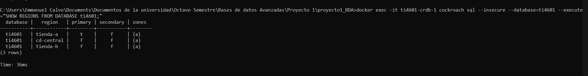
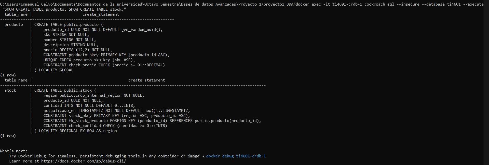
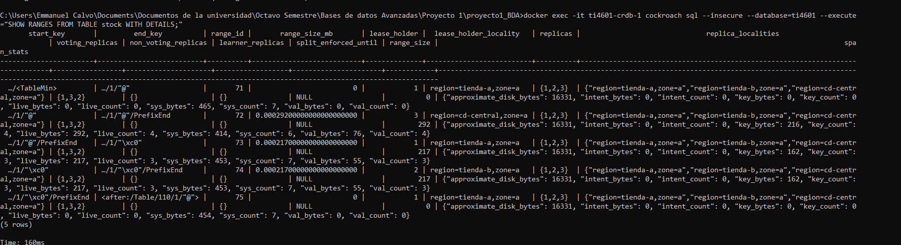

# Proyecto 1 — Base de Datos Distribuida (CockroachDB)

**Curso:** TI4601 - Bases de Datos Avanzadas -- Tecnológico de Costa Rica
**Motor:** CockroachDB ×3  
**Integrantes:** Calvo Mora Emmanuel, Feng Feng Jimmy, Navarro Ellerbrock Christian 
**Opción:** B (Sistema de comercio e inventario multi-tienda)  

El proyecto contiene la implementación y las instrucciones para desplegar, configurar y verificar el clúster multi-región de CockroachDB correspondiente al **Proyecto 1**.

---

## 1. Objetivo

Al completar los pasos de esta guía, se logra:

1. El despliegue automatizado de un clúster de CockroachDB de 3 nodos con localidades lógicas asociadas.
2. La ejecución de la configuración multi-región y aplicación del esquema con **fragmentación horizontal primaria** (`REGIONAL BY ROW`) y **tabla global** (`GLOBAL`).
3. Una carga del conjunto de datos inicial (`seed.sql`).
4. Mediante consultas de diagnóstico se realiza una inspección técnica de la distribución de rangos, localidades y estado de las regiones.

---

## 2. Arquitectura y Topología Lógica

El clúster simula una red de comercio distribuida en 3 sitios/regiones:

| Servicio | Localidad | Puerto Host | Función / Dominio |
| :--- | :--- | :--- | :--- |
| `crdb-1` | `region=tienda-a,zone=a` | SQL `26257`, UI `8080` | Nodo de entrada / Tienda A |
| `crdb-2` | `region=tienda-b,zone=a` | No publicado | Réplica / Tienda B |
| `crdb-3` | `region=cd-central,zone=a` | No publicado | Réplica / Centro de Distribución |

---

## 3. Guía de Reproducibilidad Paso a Paso Sección 2
 
### 3.1 Levantar la infraestructura Docker
 
Desde la raíz del repositorio en la terminal:
 
```cmd
docker compose --profile lab1 up -d
```
 
### 3.2 Configurar Base de Datos Multi-Región
 
Ejecutar el script de configuración de regiones sobre la base de datos `ti4601`:
 
```dos
docker exec -i ti4601-crdb-1 cockroach sql --insecure --database=ti4601 < proyecto1/configure.sql
```
 
### 3.3 Aplicar Esquema Lógico (DDL)
 
Crear las tablas con sus respectivas cláusulas de localidad (`GLOBAL` y `REGIONAL BY ROW`):
 
```dos
docker exec -i ti4601-crdb-1 cockroach sql --insecure --database=ti4601 < proyecto1/schema.sql
```
 
### 3.4 Cargar Datos Iniciales (Seed)
 
Poblar el catálogo global y los inventarios/pedidos por región:
 
```dos
docker exec -i ti4601-crdb-1 cockroach sql --insecure --database=ti4601 < proyecto1/seed.sql
```
 
---
 
## 4. Evidencias de Diagnóstico del Clúster (E2)
 
A continuación se presentan las salidas de los comandos de inspección ejecutados directamente sobre el clúster.
 
### 4.1 Verificación de Regiones (`SHOW REGIONS;`)
 
```sql
-- Salida de: SHOW REGIONS FROM DATABASE ti4601;
```


 
### 4.2 Verificación de Localidades (`SHOW CREATE TABLE;`)
 
```sql
-- Salida de: SHOW CREATE TABLE producto;
-- Salida de: SHOW CREATE TABLE stock;
```


 
### 4.3 Distribución de Rangos y Sharding (`SHOW RANGES;`)
 
```sql
-- Salida de: SHOW RANGES FROM TABLE stock WITH DETAILS;
```


 
---
 
## 5. Pruebas de Rendimiento y Tolerancia a Fallas (E3, E4, E5)
 
*(Pendiente)*
 
- **E3 — Mediciones de Latencia:** Ejecución de pruebas de lectura/escritura local y remota (p50 / p99).
- **E4 — Chaos Testing (Falla de Nodo):** Simulación de pérdida de un nodo, comprobación de quórum Raft (2/3) y cálculo de RTO/RPO.
- **E5 — Evaluación de Partición de Red:** Pruebas de aislamiento de red y consistencia.
---
 
## 6. Mantenimiento y Comandos Útiles
 
Ver estado de los nodos del clúster:
 
```dos
docker exec -it ti4601-crdb-1 cockroach node status --insecure
```
 
Detener el clúster conservando los datos:
 
```dos
docker compose --profile lab1 down
```
 
Reiniciar el clúster completamente limpio (elimina volúmenes y datos):
 
```dos
docker compose --profile lab1 down -v
```
 
---
 
## 7. Estructura del Repositorio
 
```plaintext
.
├── docker-compose.yml       # Definición del clúster de CockroachDB (3 nodos)
├── Dockerfile               # Configuración del entorno de ejecución
├── Makefile                 # Comandos de automatización del proyecto
├── requirements.txt         # Dependencias de Python para las sondas de medición
├── proyecto1/               # Artefactos del Proyecto 1
├── images/                  # Imágenes de evidencia salida de consola
│   ├── configure.sql        # Asignación de regiones al clúster
│   ├── schema.sql           # Tablas, PKs y estrategias de LOCALITY
│   ├── seed.sql             # Carga inicial de datos de prueba
│   └── diseno.md            # Documentación teórica y diseño conceptual (E1)
└── README.md                # Guía de reproducibilidad y evidencias (E2)
```